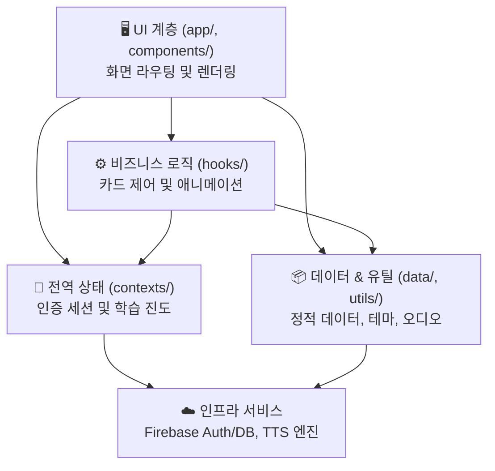

# 📘 LingoFlow — 코드베이스 파악 및 온보딩 개발 가이드 (Developer Guide)

> **작성자**: Principal React Native / Expo Lead Engineer  
> **대상**: LingoFlow 프로젝트에 새로 합류한 개발자, 협업자 및 AI 에이전트  
> **버전**: v1.0.2 (SDK 54 / Expo Router v6)

---

## 📑 목차 (Table of Contents)
1. [아키텍처 및 기술 스택 개요 (Architecture Overview)](#1-아키텍처-및-기술-스택-개요)
   - [관심사의 분리란?](#관심사의-분리란)
   - [계층별 역할](#계층별-역할)
   - [화살표(의존 방향)의 의미](#화살표의존-방향의-의미)
2. [디렉터리 및 주요 파일별 상세 역할 (Directory Breakdown)](#2-디렉터리-및-주요-파일별-상세-역할)
   - [app/ 디렉터리 (Expo Router 라우팅)](#app-디렉터리-화면-및-라우팅)
   - [src/ 디렉터리 (코어 비즈니스 로직)](#src-디렉터리-비즈니스-로직-및-모듈)
   - [데이터 및 제어 흐름 (Data Flow)](#데이터-및-제어-흐름-data-flow)
3. [설정 파일 및 AI 협업 체계 분석 (Config & AI Integration)](#3-설정-파일-및-ai-협업-체계-분석)
4. [신규 기능 추가 표준 워크플로우 (Feature Development Pipeline)](#4-신규-기능-추가-표준-워크플로우)
5. [품질 검증 및 빌드/배포 가이드 (Verification & Deployment)](#5-품질-검증-및-빌드배포-가이드)

---

## 1. 아키텍처 및 기술 스택 개요

LingoFlow는 **실전 영어 회화 표현을 3D 플래시카드와 음성(TTS)으로 마스터하는 모바일 학습 애플리케이션**입니다.

### 관심사의 분리란?

**관심사의 분리(Separation of Concerns)** 는 **"한 파일·폴더가 한 가지 역할만 맡도록 나눈다"**는 설계 원칙입니다.

화면 그리기, 학습 규칙 처리, 앱 전역 상태, 외부 서비스(Firebase·TTS)를 한곳에 섞지 않고, 각각 다른 **계층(Layer)** 에 두었습니다. 한 계층을 수정할 때 다른 계층이 덜 흔들리도록 만드는 것이 목표입니다.

> **한 줄 요약**: UI는 **그리기만**, 훅은 **규칙만**, Context는 **저장만**, data/utils는 **자원만**, Firebase·TTS는 **외부 연결만**.

### 계층별 역할

| 계층 | 위치 | 하는 일 | 대표 파일 |
|:---|:---|:---|:---|
| **UI** | `app/`, `src/components/` | 화면 라우팅, 레이아웃, 버튼·카드 렌더링 | `app/study.tsx`, `FlashCard.tsx` |
| **비즈니스 로직** | `src/hooks/` | 학습 세션 규칙·흐름 (뒤집기, XP, 하트, 다음 카드) | `useStudyCard.ts` |
| **상태 관리** | `src/contexts/` | 앱 전역 상태 저장소 (인증, XP, 레벨, 마스터 ID) | `AuthContext.tsx`, `ProgressContext.tsx` |
| **데이터 & 유틸** | `src/data/`, `src/utils/`, `src/constants/`, `src/types/` | 정적 콘텐츠, 디자인 토큰, 타입, TTS 래퍼 | `expressions.json`, `theme.ts`, `audioPlayer.ts` |
| **인프라** | `firebaseConfig.ts`, 외부 SDK | Firebase Auth/DB, Expo Speech TTS | `firebaseConfig.ts`, `expo-speech` |

#### 1️⃣ UI 계층 — `app/`, `src/components/`

사용자에게 **보이는 것**만 담당합니다. Expo Router 화면(`app/`)과 재사용 컴포넌트(`components/`)로 구성됩니다.

- **원칙**: "어떻게 그릴지"만 알고, XP 계산이나 카드 뒤집기 규칙은 직접 구현하지 않습니다.
- **예시**: `app/study.tsx`는 `useStudyCard` 훅에서 값·함수를 받아 화면에 배치합니다. `FlashCard.tsx`는 props(텍스트, 애니메이션 스타일)만 받아 카드를 그립니다.

#### 2️⃣ 비즈니스 로직 계층 — `src/hooks/`

**"학습 세션에서 일어나는 일"** 의 규칙과 흐름을 처리합니다.

- 카드 3D 뒤집기 애니메이션, 퀴즈 모드 전환
- **Mastered** → XP +15 + 마스터 ID 기록 / **Review** → 하트 -1
- 다음·이전 카드 이동, TTS 재생/정지, 세션 통계 집계
- **예시**: 화면은 "Mastered 버튼 눌림"만 알리고, `useStudyCard.goNext()` 가 점수·하트·다음 카드 로직을 처리합니다.

#### 3️⃣ 상태 관리 계층 — `src/contexts/`

앱 전체에서 공유하는 **상태 저장소**입니다. React Context로 어디서든 같은 데이터를 읽고 갱신합니다.

| Context | 관리하는 상태 |
|:---|:---|
| `AuthContext` | 로그인 사용자, 로딩 여부, 로그아웃, displayName |
| `ProgressContext` | Streak, Hearts, XP, Level, 마스터한 표현 ID |

- `app/_layout.tsx`에서 `AuthProvider` → `ProgressProvider` 순으로 앱 전체를 감쌉니다.
- 훅(`useStudyCard`)은 Context의 **변경 함수**(`addXp`, `markMastered`)를 호출하고, 화면(`index`, `profile`)은 Context **값**을 읽어 표시만 합니다.

#### 4️⃣ 데이터 & 유틸 계층 — `src/data/`, `src/utils/`, `src/constants/`, `src/types/`

비즈니스·UI와 분리된 **정적·순수 자원**입니다.

- `expressions.json` — 246개 영어 표현 콘텐츠
- `theme.ts` — 색상·간격·그림자 디자인 토큰
- `audioPlayer.ts` — Expo Speech TTS 재생/정지 래퍼
- `types/index.ts` — `Expression`, `StudySessionStats` 등 도메인 타입

#### 5️⃣ 인프라 계층 — Firebase, TTS

앱 **바깥**의 외부 서비스·네이티브 기능입니다.

- `firebaseConfig.ts` — Firebase Auth, Firestore, Storage 초기화 (멱등 패턴)
- Firebase Auth — 로그인/회원가입, 세션 구독 (`AuthContext`)
- Expo Speech — 영어 발음 TTS (`audioPlayer.ts`)

> **접근 규칙**: UI·훅·Context는 가능한 한 Firebase SDK를 직접 호출하지 않고, Context나 유틸을 통해 접근합니다.  
> (예외: `login.tsx` / `signup.tsx`는 로그인 화면에서만 쓰는 일회성 액션이므로 `signInWithEmailAndPassword` 등을 직접 호출합니다.)

### 🛠️ 핵심 기술 스택
| 영역 | 기술 | 버전 / 비고 |
|:---|:---|:---|
| **Core Framework** | React Native / Expo | Expo SDK 54 / React Native 0.81 (Hermes Engine) |
| **Routing** | Expo Router | v6 (파일 시스템 기반 스택 라우팅) |
| **Language** | TypeScript | v5.9 (Strict Type Checking) |
| **Backend & Auth** | Firebase JS SDK | v12.17 (Firebase Authentication, Firestore) |
| **Audio & TTS** | Expo Speech | `expo-speech` (Conversational Rate 0.88x) |
| **Design System** | Pure Tokenized StyleSheet | `src/constants/theme.ts` (Cyberpunk / Midnight Dark Luxury) |
| **Cloud Build** | EAS (Expo Application Services) | Android APK (`preview`) & AAB (`production`) |

### 🏛️ 시스템 아키텍처 다이어그램



### 화살표(의존 방향)의 의미

다이어그램의 화살표는 **"위 계층이 아래 계층을 사용한다"**는 의존 방향을 나타냅니다.

```
UI      → State   : 화면이 XP·로그인 상태를 읽음 (useAuth, useProgress)
UI      → Logic   : study 화면이 useStudyCard 호출
UI      → Data     : theme, expressions.json import
Logic   → State   : goNext()가 addXp(), markMastered() 호출
Logic   → Data    : audioPlayer, types 사용
State   → Infra   : AuthContext가 Firebase onAuthStateChanged 구독
Data    → Infra   : audioPlayer가 expo-speech 호출
```

**역방향은 없습니다.** Firebase가 화면을 직접 그리지 않고, Context가 훅을 호출하지 않습니다. 이것이 "격리"의 핵심입니다.

### 이렇게 나누면 얻는 것

| 이점 | LingoFlow에서의 예 |
|:---|:---|
| **변경 영향 최소화** | Cyberpunk 테마 변경 → `theme.ts`만 수정 |
| **기능 추가 용이** | [5단계 개발 파이프라인](#4-신규-기능-추가-표준-워크플로우) 준수 |
| **협업·AI 페어 프로그래밍** | "훅만 수정", "Context만 수정"처럼 작업 범위를 좁힐 수 있음 |
| **재사용** | `FlashCard`를 다른 학습 모드에서도 그대로 사용 가능 |

### 현재 구현 상태 (주의)

문서와 다이어그램은 Firestore 동기화를 염두에 두고 설계되어 있으나, **현재 `ProgressContext`는 메모리(in-memory) 상태**입니다. 앱을 재시작하면 XP·마스터 목록이 초기화됩니다. Firestore 연동 시에는 `src/services/`에 서비스를 추가하고 Context가 해당 서비스를 호출하는 방식으로 [4장 Step 2](#4-신규-기능-추가-표준-워크플로우) 패턴을 따릅니다.

---

## 2. 디렉터리 및 주요 파일별 상세 역할

> 아래 디렉터리 구조는 [1장 계층별 역할](#계층별-역할)과 1:1로 대응됩니다. `app/`·`components/` = UI, `hooks/` = 로직, `contexts/` = 상태, 나머지 `src/` = 데이터·유틸, `firebaseConfig.ts` = 인프라.

### `app/` 디렉터리 (화면 및 라우팅)
Expo Router의 파일 시스템 규칙에 따라 `app/` 내부의 파일들은 자동으로 고유 URL 경로에 매핑됩니다.

```
app/
├── _layout.tsx      # 최상위 Root Provider 주입 및 Navigation Stack 정의
├── index.tsx        # 메인 대시보드 화면 (URL: /)
├── study.tsx        # 3D 플래시카드 학습 화면 (URL: /study)
├── profile.tsx      # 사용자 프로필, 레벨 진행도, 업적 화면 (URL: /profile)
├── login.tsx        # 사용자 로그인 화면 (URL: /login)
└── signup.tsx       # 신규 회원가입 화면 (URL: /signup)
```

#### 파일별 상세 역할
1. **`_layout.tsx` (Root Navigator & Providers)**
   - 앱 구동 시 가장 먼저 마운트되는 최상위 루트 컴포넌트입니다.
   - `AuthProvider`와 `ProgressProvider`를 전역에 래핑하여 모든 하위 화면에 사용자 세션과 학습 진도를 공급합니다.
   - React Navigation Stack의 공통 헤더 스타일(다크 배경, 퍼플 액센트) 및 StatusBar를 관리합니다.

2. **`index.tsx` (메인 대시보드 화면)**
   - **인증 가드(Auth Guard)**: 미인증 사용자의 경우 `<Redirect href="/login" />` 컴포넌트를 통해 안전하게 로그인 화면으로 보냅니다.
   - **실시간 통계 스트립**: 연속 학습일(Streak), 에너지(Hearts), 총 경험치(XP) 및 현재 레벨(Lv.)을 한눈에 표시합니다.
   - **퀵 스타트 배너**: 클릭 한 번으로 메인 회화 표현 학습 세션을 즉시 시작합니다.
   - **카테고리 그리드**: 12개 주제별 카테고리(`Daily Conversation`, `Actions & Habits`, `Feelings & Mindset` 등)를 렌더링하고 클릭 시 `study.tsx`로 네비게이션합니다.

3. **`study.tsx` (학습 화면)**
   - URL 파라미터(`categoryId`)를 수신하여 `expressions.json` 데이터셋 중 해당하는 표현을 필터링합니다.
   - `useStudyCard` 훅과 연동하여 플래시카드의 앞/뒷면 뒤집기, 퀴즈 모드(한국어 먼저 보기) 토글, 앞/뒤 탐색을 제어합니다.
   - 카드를 **Mastered(+15 XP)** 또는 **Review(-1 Heart)**로 채점하며, 세션 완료 시 축하 모달(Stats Summary)을 띄웁니다.

4. **`profile.tsx` (프로필 및 업적 화면)**
   - 사용자 닉네임, 이메일, 아바타 서클을 표시합니다.
   - **XP 레벨 프로그레스 바**: 현재 레벨 내 진척도(`levelProgress%`)와 다음 레벨까지 필요한 경험치를 시각화합니다.
   - **4단계 업적 시스템**: `First Step`, `Streak Starter`, `Vocabulary Builder`, `Centurion Learner`의 해금 여부를 동적으로 렌더링합니다.
   - 안전한 확인 다이얼로그(Alert)를 거치는 로그아웃 기능을 제공합니다.

5. **`login.tsx` & `signup.tsx` (인증 화면)**
   - Firebase Auth와 직접 연동되어 이메일/비밀번호 로그인을 수행합니다.
   - 비밀번호 표시/숨김 토글, 이메일 유효성 검사, 비밀번호 확인 일치 검사, 제출 중 `ActivityIndicator` 스피너를 포함합니다.
   - 이미 로그인된 상태일 경우 자동으로 홈(`/`)으로 리다이렉트합니다.

---

### `src/` 디렉터리 (비즈니스 로직 및 모듈)

`src/` 디렉터리는 화면(View)에서 독립된 순수 UI 컴포넌트, 상태 저장소, 비즈니스 훅, 유틸리티를 담고 있습니다.

```
src/
├── components/           # 순수 재사용 UI 컴포넌트
│   ├── CategoryCard.tsx  # 대시보드의 주제별 카드 컴포넌트
│   └── FlashCard.tsx     # 3D Y축 회전 애니메이션 플래시카드
├── constants/            # 전역 상수 및 디자인 토큰
│   ├── categories.ts     # 12개 카테고리 메타데이터 (아이콘, 카운트, 색상)
│   └── theme.ts          # 색상(COLORS), 반경(RADIUS), 간격(SPACING), 그림자(SHADOW)
├── contexts/             # React Context 전역 상태
│   ├── AuthContext.tsx   # Firebase Auth 사용자 인증 세션 상태
│   └── ProgressContext.tsx # Streak, Hearts, XP, Level, Mastered IDs 상태
├── data/                 # 정적 데이터 파일
│   └── expressions.json  # 246개 실전 영어 회화 마스터 데이터셋
├── hooks/                # 비즈니스 커스텀 훅
│   └── useStudyCard.ts   # 플래시카드 뒤집기 애니메이션 및 세션 통계 훅
├── types/                # TypeScript 도메인 모델 정의
│   └── index.ts          # Expression, Category, Achievement, StudySessionStats
└── utils/                # 공통 헬퍼 유틸리티
    └── audioPlayer.ts    # Expo Speech 기반 네이티브 TTS 발음 엔진
```

---

### 데이터 및 제어 흐름 (Data Flow)

**"Mastered" 버튼 클릭** 하나가 5개 계층을 순서대로 거치는 전형적인 흐름입니다:

```
[사용자] Mastered 탭
    │
    ▼
[UI] app/study.tsx
    handleNextAction(true) → goNext(true)
    │
    ▼
[Logic] src/hooks/useStudyCard.ts
    ├─ stopExpressionAudio()  → [Data/Util] audioPlayer.ts → [Infra] Speech.stop()
    ├─ addXp(15)              → [State] ProgressContext.tsx
    ├─ markMastered(id)       → [State] ProgressContext.tsx
    ├─ Animated.spring()      → 카드 애니메이션 리셋 (훅 로컬 상태)
    └─ setCurrentIndex(+1)    → 다음 표현으로 이동
    │
    ▼
[UI] src/components/FlashCard.tsx
    새 영어/한국어 텍스트 및 EN/KO 뱃지 재렌더링
    │
    ▼
[UI] app/index.tsx, app/profile.tsx
    Context의 xp, level 변경이 대시보드·프로필에 반영
```

각 단계의 책임이 분명합니다. UI는 이벤트만 전달하고, 훅이 규칙을 실행하며, Context가 상태를 저장하고, 유틸·인프라가 TTS를 처리합니다.

---

## 3. 설정 파일 및 AI 협업 체계 분석

LingoFlow는 개발자 간의 원활한 협업뿐만 아니라 **AI 코딩 어시스턴트(Claude, Gemini 등)와의 무결점 페어 프로그래밍**을 위해 최적화된 설정 체계를 갖추고 있습니다.

### ⚙️ 핵심 설정 파일
* **`firebaseConfig.ts`**:
  - Firebase JS SDK v12를 안전하게 초기화합니다.
  - 앱 구동 시 중복 초기화를 방지하는 멱등성 패턴(`getApps().length === 0 ? initializeApp(...) : getApp()`)을 적용하여 런타임 크래시를 원천 차단합니다.
* **`app.json`**:
  - Expo 애플리케이션의 메타데이터, 패키지명(`com.wits73.LingoFlow`), 안드로이드 Adaptive Icon(`assets/android-icon-*.png`), 스킴(`lingoflow`)을 정의합니다.
* **`eas.json`**:
  - EAS 클라우드 빌드 프로파일을 정의합니다:
    - `preview`: 실기기 즉시 테스트용 독립형 APK 빌드 (`buildType: "apk"`)
    - `production`: 구글 플레이 스토어 배포용 AAB 번들 빌드 (`autoIncrement: true`)
* **`tsconfig.json`**:
  - TypeScript의 엄격한 타입 체킹(`strict: true`) 및 JSX 변환 옵션을 보장합니다.

### 🤖 AI 협업 파일 및 존재 이유

| 파일명 | 역할 및 목적 |
|:---|:---|
| **`AGENTS.md`** | **AI 에이전트 행동 지침서**: AI가 코드를 작성하거나 수정할 때 준수해야 할 디자인 토큰 원칙, 파일 분리 컨벤션, 네이티브 호환성 주의사항을 명시합니다. |
| **`CLAUDE.md`** | **LLM 컨텍스트 가이드**: Claude 또는 LLM이 프로젝트의 기술 스택, 라우팅 방식, 아키텍처 구조를 즉시 파악할 수 있도록 돕는 프롬프트 앵커 역할을 수행합니다. |
| **`workflow.md`** | **표준 운영 매뉴얼 (SOP)**: 현재 보고 계신 문서로, 새로 온보딩된 엔지니어와 AI가 동일한 작업 멘탈 모델을 공유할 수 있도록 돕는 단일 진실 공급원(SSOT)입니다. |

---

## 4. 신규 기능 추가 표준 워크플로우

LingoFlow 프로젝트에 새로운 기능(예: "표현 북마크/즐겨찾기 기능", "새 카테고리 추가", "Firebase 실시간 동기화")을 개발할 때는 **아래 5단계 표준 파이프라인**을 엄격히 준수합니다.

```
[1. Types] ──> [2. Services/Data] ──> [3. Contexts/Hooks] ──> [4. Components] ──> [5. app/ Pages]
```

### 📋 단계별 개발 가이드 예시 (즐겨찾기 Bookmark 기능 추가 시)

#### Step 1. 도메인 타입 정의 (`src/types/index.ts`)
데이터 모델 인터페이스를 먼저 선언하여 컴파일 타임 안정성을 확보합니다.
```typescript
// src/types/index.ts
export interface BookmarkItem {
  expressionId: string;
  bookmarkedAt: number;
}
```

#### Step 2. 유틸리티 / 서비스 작성 (`src/services/` or `src/utils/`)
필요한 외부 통신 로직이나 순수 함수를 구현합니다.
```typescript
// src/services/bookmarkService.ts
export async function syncBookmarkToCloud(userId: string, expressionId: string) {
  // Firestore 저장 로직
}
```

#### Step 3. 상태 관리 및 훅 확장 (`src/contexts/` & `src/hooks/`)
전역 상태 저장소(`ProgressContext.tsx`)에 상태 및 디스패치 액션을 추가합니다.
```typescript
// src/contexts/ProgressContext.tsx
const [bookmarks, setBookmarks] = useState<string[]>([]);
const toggleBookmark = (id: string) => {
  setBookmarks(prev => prev.includes(id) ? prev.filter(x => x !== id) : [...prev, id]);
};
```

#### Step 4. UI 컴포넌트 제작 (`src/components/`)
`src/constants/theme.ts`의 `COLORS`, `RADIUS`, `SHADOW` 토큰을 사용하여 재사용 가능한 컴포넌트를 작성합니다. (하드코딩 스타일 절대 금지)
```typescript
// src/components/BookmarkButton.tsx
import { COLORS } from '../constants/theme';
// 컴포넌트 구현
```

#### Step 5. 화면 조립 및 라우팅 연결 (`app/`)
만들어진 컴포넌트와 훅을 `app/study.tsx` 또는 새 라우트 파일에 조립합니다.
```typescript
// app/study.tsx
const { toggleBookmark, isBookmarked } = useProgress();
// UI 상단에 BookmarkButton 배치
```

---

## 5. 품질 검증 및 빌드/배포 가이드

### 🧪 1. 로컬 코드 품질 검증 (필수)
모든 커밋 전 반드시 TypeScript 컴파일 오류가 없는지 확인합니다.
```bash
# TypeScript 컴파일 검사 (0 Errors 필수)
npx tsc --noEmit
```

### 💻 2. 로컬 개발 서버 실행
```bash
# Metro 번들러 캐시 초기화 후 실행
npx expo start --clear
```

### 📦 3. EAS 클라우드 빌드 배포

#### A. 스마트폰 즉시 테스트용 APK 빌드 (`preview`)
```bash
eas build -p android --profile preview
```
* 빌드 완료 후 생성되는 `.apk` 링크를 스마트폰으로 다운로드하여 즉시 테스트할 수 있습니다.

#### B. 구글 플레이 스토어 출시용 AAB 번들 빌드 (`production`)
```bash
eas build -p android --profile production
```
* 빌드 완료 후 `.aab` 파일을 다운로드하여 [Google Play Console](https://play.google.com/console) 내부 테스트에 업로드합니다.

---

> 💡 **온보딩 팁**: 스타일을 수정할 때는 언제나 `src/constants/theme.ts`를 먼저 확인하세요. 새로운 색상이 필요하면 `theme.ts`에 토큰을 추가한 후 참조하는 것이 프로젝트의 일관성을 유지하는 비결입니다. 즐거운 코딩 되세요! 🚀
