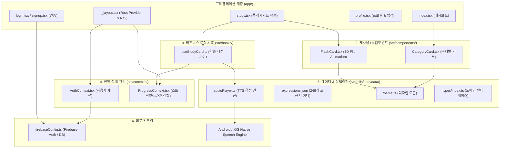

# 📘 LingoFlow — 코드베이스 파악 및 온보딩 개발 가이드 (Developer Guide)

> **작성자**: Principal React Native / Expo Lead Engineer  
> **대상**: LingoFlow 프로젝트에 새로 합류한 개발자, 협업자 및 AI 에이전트  
> **버전**: v1.0.1 (SDK 54 / Expo Router v6)

---

## 📑 목차 (Table of Contents)
1. [아키텍처 및 기술 스택 개요 (Architecture Overview)](#1-아키텍처-및-기술-스택-개요)
2. [디렉터리 및 주요 파일별 상세 역할 (Directory Breakdown)](#2-디렉터리-및-주요-파일별-상세-역할)
   - [app/ 디렉터리 (Expo Router 라우팅)](#app-디렉터리-화면-및-라우팅)
   - [src/ 디렉터리 (코어 비즈니스 로직)](#src-디렉터리-비즈니스-로직-및-모듈)
   - [데이터 및 제어 흐름 (Data Flow)](#데이터-및-제어-흐름-data-flow)
3. [설정 파일 및 AI 협업 체계 분석 (Config & AI Integration)](#3-설정-파일-및-ai-협업-체계-분석)
4. [신규 기능 추가 표준 워크플로우 (Feature Development Pipeline)](#4-신규-기능-추가-표준-워크플로우)
5. [품질 검증 및 빌드/배포 가이드 (Verification & Deployment)](#5-품질-검증-및-빌드배포-가이드)

---

## 1. 아키텍처 및 기술 스택 개요

LingoFlow는 **실전 영어 회화 표현을 3D 플래시카드와 음성(TTS)으로 마스터하는 모바일 학습 애플리케이션**입니다.  
본 프로젝트는 **관심사의 분리(Separation of Concerns)** 원칙에 따라 UI 계층, 비즈니스 로직 계층, 상태 관리 계층, 인프라(Firebase) 계층이 명확히 격리되어 설계되었습니다.

### 🛠️ 핵심 기술 스택
| 영역 | 기술 | 버전 / 비고 |
|:---|:---|:---|
| **Core Framework** | React Native / Expo | Expo SDK 54 / React Native 0.81 (Hermes Engine) |
| **Routing** | Expo Router | v6 (파일 시스템 기반 스택 라우팅) |
| **Language** | TypeScript | v5.9 (Strict Type Checking) |
| **Backend & Auth** | Firebase JS SDK | v12.17 (Firebase Authentication, Firestore) |
| **Audio & TTS** | Expo Speech | `expo-speech` (Conversational Rate 0.88x) |
| **Design System** | Pure Tokenized StyleSheet | `src/constants/theme.ts` (Cyberpunk / Midnight Dark Luxury) |
| **Cloud Build** | EAS (Expo Application Services) | Android APK (`preview`) & AAB (`production`) |

### 🏛️ 시스템 아키텍처 다이어그램



---

## 2. 디렉터리 및 주요 파일별 상세 역할

### `app/` 디렉터리 (화면 및 라우팅)
Expo Router의 파일 시스템 규칙에 따라 `app/` 내부의 파일들은 자동으로 고유 URL 경로에 매핑됩니다.

```
app/
├── _layout.tsx      # 최상위 Root Provider 주입 및 Navigation Stack 정의
├── index.tsx        # 메인 대시보드 화면 (URL: /)
├── study.tsx        # 3D 플래시카드 학습 화면 (URL: /study)
├── profile.tsx      # 사용자 프로필, 레벨 진행도, 업적 화면 (URL: /profile)
├── login.tsx        # 사용자 로그인 화면 (URL: /login)
└── signup.tsx       # 신규 회원가입 화면 (URL: /signup)
```

#### 파일별 상세 역할
1. **`_layout.tsx` (Root Navigator & Providers)**
   - 앱 구동 시 가장 먼저 마운트되는 최상위 루트 컴포넌트입니다.
   - `AuthProvider`와 `ProgressProvider`를 전역에 래핑하여 모든 하위 화면에 사용자 세션과 학습 진도를 공급합니다.
   - React Navigation Stack의 공통 헤더 스타일(다크 배경, 퍼플 액센트) 및 StatusBar를 관리합니다.

2. **`index.tsx` (메인 대시보드 화면)**
   - **인증 가드(Auth Guard)**: 미인증 사용자의 경우 `<Redirect href="/login" />` 컴포넌트를 통해 안전하게 로그인 화면으로 보냅니다.
   - **실시간 통계 스트립**: 연속 학습일(Streak), 에너지(Hearts), 총 경험치(XP) 및 현재 레벨(Lv.)을 한눈에 표시합니다.
   - **퀵 스타트 배너**: 클릭 한 번으로 메인 회화 표현 학습 세션을 즉시 시작합니다.
   - **카테고리 그리드**: 6개 핵심 주제별 카테고리(`Daily & Casual`, `Idioms & Slang` 등)를 렌더링하고 클릭 시 `study.tsx`로 네비게이션합니다.

3. **`study.tsx` (학습 화면)**
   - URL 파라미터(`categoryId`)를 수신하여 `expressions.json` 데이터셋 중 해당하는 표현을 필터링합니다.
   - `useStudyCard` 훅과 연동하여 플래시카드의 앞/뒷면 뒤집기, 퀴즈 모드(한국어 먼저 보기) 토글, 앞/뒤 탐색을 제어합니다.
   - 카드를 **Mastered(+15 XP)** 또는 **Review(-1 Heart)**로 채점하며, 세션 완료 시 축하 모달(Stats Summary)을 띄웁니다.

4. **`profile.tsx` (프로필 및 업적 화면)**
   - 사용자 닉네임, 이메일, 아바타 서클을 표시합니다.
   - **XP 레벨 프로그레스 바**: 현재 레벨 내 진척도(`levelProgress%`)와 다음 레벨까지 필요한 경험치를 시각화합니다.
   - **4단계 업적 시스템**: `First Step`, `Streak Starter`, `Vocabulary Builder`, `Centurion Learner`의 해금 여부를 동적으로 렌더링합니다.
   - 안전한 확인 다이얼로그(Alert)를 거치는 로그아웃 기능을 제공합니다.

5. **`login.tsx` & `signup.tsx` (인증 화면)**
   - Firebase Auth와 직접 연동되어 이메일/비밀번호 로그인을 수행합니다.
   - 비밀번호 표시/숨김 토글, 이메일 유효성 검사, 비밀번호 확인 일치 검사, 제출 중 `ActivityIndicator` 스피너를 포함합니다.
   - 이미 로그인된 상태일 경우 자동으로 홈(`/`)으로 리다이렉트합니다.

---

### `src/` 디렉터리 (비즈니스 로직 및 모듈)

`src/` 디렉터리는 화면(View)에서 독립된 순수 UI 컴포넌트, 상태 저장소, 비즈니스 훅, 유틸리티를 담고 있습니다.

```
src/
├── components/           # 순수 재사용 UI 컴포넌트
│   ├── CategoryCard.tsx  # 대시보드의 주제별 카드 컴포넌트
│   └── FlashCard.tsx     # 3D Y축 회전 애니메이션 플래시카드
├── constants/            # 전역 상수 및 디자인 토큰
│   ├── categories.ts     # 6개 카테고리 메타데이터 (아이콘, 카운트, 색상)
│   └── theme.ts          # 색상(COLORS), 반경(RADIUS), 간격(SPACING), 그림자(SHADOW)
├── contexts/             # React Context 전역 상태
│   ├── AuthContext.tsx   # Firebase Auth 사용자 인증 세션 상태
│   └── ProgressContext.tsx # Streak, Hearts, XP, Level, Mastered IDs 상태
├── data/                 # 정적 데이터 파일
│   └── expressions.json  # 246개 실전 영어 회화 마스터 데이터셋
├── hooks/                # 비즈니스 커스텀 훅
│   └── useStudyCard.ts   # 플래시카드 뒤집기 애니메이션 및 세션 통계 훅
├── types/                # TypeScript 도메인 모델 정의
│   └── index.ts          # Expression, Category, Achievement, StudySessionStats
└── utils/                # 공통 헬퍼 유틸리티
    └── audioPlayer.ts    # Expo Speech 기반 네이티브 TTS 발음 엔진
```

---

### 데이터 및 제어 흐름 (Data Flow)

컴포넌트 간 상호작용과 데이터 흐름은 아래 파이프라인을 따릅니다:

```
[사용자 터치: 'Mastered' 버튼 클릭]
       │
       ▼
app/study.tsx ──> goNext(true) 호출
       │
       ▼
src/hooks/useStudyCard.ts
  ├─ 1. stopExpressionAudio() ──> src/utils/audioPlayer.ts (재생 중지)
  ├─ 2. addXp(15) ─────────────> src/contexts/ProgressContext.tsx (XP 및 레벨 증가)
  ├─ 3. markMastered(exp_id) ──> src/contexts/ProgressContext.tsx (마스터 ID 저장)
  ├─ 4. Animated.spring() ─────> 카드 각도 0도로 부드럽게 리셋
  └─ 5. setCurrentIndex(+1) ───> 다음 표현 데이터 로드
       │
       ▼
src/components/FlashCard.tsx ──> 새 단어 텍스트 및 EN/KO 뱃지 재렌더링
```

---

## 3. 설정 파일 및 AI 협업 체계 분석

LingoFlow는 개발자 간의 원활한 협업뿐만 아니라 **AI 코딩 어시스턴트(Claude, Gemini 등)와의 무결점 페어 프로그래밍**을 위해 최적화된 설정 체계를 갖추고 있습니다.

### ⚙️ 핵심 설정 파일
* **`firebaseConfig.ts`**:
  - Firebase JS SDK v12를 안전하게 초기화합니다.
  - 앱 구동 시 중복 초기화를 방지하는 멱등성 패턴(`getApps().length === 0 ? initializeApp(...) : getApp()`)을 적용하여 런타임 크래시를 원천 차단합니다.
* **`app.json`**:
  - Expo 애플리케이션의 메타데이터, 패키지명(`com.wits73.LingoFlow`), 안드로이드 Adaptive Icon(`assets/android-icon-*.png`), 스킴(`lingoflow`)을 정의합니다.
* **`eas.json`**:
  - EAS 클라우드 빌드 프로파일을 정의합니다:
    - `preview`: 실기기 즉시 테스트용 독립형 APK 빌드 (`buildType: "apk"`)
    - `production`: 구글 플레이 스토어 배포용 AAB 번들 빌드 (`autoIncrement: true`)
* **`tsconfig.json`**:
  - TypeScript의 엄격한 타입 체킹(`strict: true`) 및 JSX 변환 옵션을 보장합니다.

### 🤖 AI 협업 파일 및 존재 이유

| 파일명 | 역할 및 목적 |
|:---|:---|
| **`AGENTS.md`** | **AI 에이전트 행동 지침서**: AI가 코드를 작성하거나 수정할 때 준수해야 할 디자인 토큰 원칙, 파일 분리 컨벤션, 네이티브 호환성 주의사항을 명시합니다. |
| **`CLAUDE.md`** | **LLM 컨텍스트 가이드**: Claude 또는 LLM이 프로젝트의 기술 스택, 라우팅 방식, 아키텍처 구조를 즉시 파악할 수 있도록 돕는 프롬프트 앵커 역할을 수행합니다. |
| **`workflow.md`** | **표준 운영 매뉴얼 (SOP)**: 현재 보고 계신 문서로, 새로 온보딩된 엔지니어와 AI가 동일한 작업 멘탈 모델을 공유할 수 있도록 돕는 단일 진실 공급원(SSOT)입니다. |

---

## 4. 신규 기능 추가 표준 워크플로우

LingoFlow 프로젝트에 새로운 기능(예: "표현 북마크/즐겨찾기 기능", "새 카테고리 추가", "Firebase 실시간 동기화")을 개발할 때는 **아래 5단계 표준 파이프라인**을 엄격히 준수합니다.

```
[1. Types] ──> [2. Services/Data] ──> [3. Contexts/Hooks] ──> [4. Components] ──> [5. app/ Pages]
```

### 📋 단계별 개발 가이드 예시 (즐겨찾기 Bookmark 기능 추가 시)

#### Step 1. 도메인 타입 정의 (`src/types/index.ts`)
데이터 모델 인터페이스를 먼저 선언하여 컴파일 타임 안정성을 확보합니다.
```typescript
// src/types/index.ts
export interface BookmarkItem {
  expressionId: string;
  bookmarkedAt: number;
}
```

#### Step 2. 유틸리티 / 서비스 작성 (`src/services/` or `src/utils/`)
필요한 외부 통신 로직이나 순수 함수를 구현합니다.
```typescript
// src/services/bookmarkService.ts
export async function syncBookmarkToCloud(userId: string, expressionId: string) {
  // Firestore 저장 로직
}
```

#### Step 3. 상태 관리 및 훅 확장 (`src/contexts/` & `src/hooks/`)
전역 상태 저장소(`ProgressContext.tsx`)에 상태 및 디스패치 액션을 추가합니다.
```typescript
// src/contexts/ProgressContext.tsx
const [bookmarks, setBookmarks] = useState<string[]>([]);
const toggleBookmark = (id: string) => {
  setBookmarks(prev => prev.includes(id) ? prev.filter(x => x !== id) : [...prev, id]);
};
```

#### Step 4. UI 컴포넌트 제작 (`src/components/`)
`src/constants/theme.ts`의 `COLORS`, `RADIUS`, `SHADOW` 토큰을 사용하여 재사용 가능한 컴포넌트를 작성합니다. (하드코딩 스타일 절대 금지)
```typescript
// src/components/BookmarkButton.tsx
import { COLORS } from '../constants/theme';
// 컴포넌트 구현
```

#### Step 5. 화면 조립 및 라우팅 연결 (`app/`)
만들어진 컴포넌트와 훅을 `app/study.tsx` 또는 새 라우트 파일에 조립합니다.
```typescript
// app/study.tsx
const { toggleBookmark, isBookmarked } = useProgress();
// UI 상단에 BookmarkButton 배치
```

---

## 5. 품질 검증 및 빌드/배포 가이드

### 🧪 1. 로컬 코드 품질 검증 (필수)
모든 커밋 전 반드시 TypeScript 컴파일 오류가 없는지 확인합니다.
```bash
# TypeScript 컴파일 검사 (0 Errors 필수)
npx tsc --noEmit
```

### 💻 2. 로컬 개발 서버 실행
```bash
# Metro 번들러 캐시 초기화 후 실행
npx expo start --clear
```

### 📦 3. EAS 클라우드 빌드 배포

#### A. 스마트폰 즉시 테스트용 APK 빌드 (`preview`)
```bash
eas build -p android --profile preview
```
* 빌드 완료 후 생성되는 `.apk` 링크를 스마트폰으로 다운로드하여 즉시 테스트할 수 있습니다.

#### B. 구글 플레이 스토어 출시용 AAB 번들 빌드 (`production`)
```bash
eas build -p android --profile production
```
* 빌드 완료 후 `.aab` 파일을 다운로드하여 [Google Play Console](https://play.google.com/console) 내부 테스트에 업로드합니다.

---

> 💡 **온보딩 팁**: 스타일을 수정할 때는 언제나 `src/constants/theme.ts`를 먼저 확인하세요. 새로운 색상이 필요하면 `theme.ts`에 토큰을 추가한 후 참조하는 것이 프로젝트의 일관성을 유지하는 비결입니다. 즐거운 코딩 되세요! 🚀
